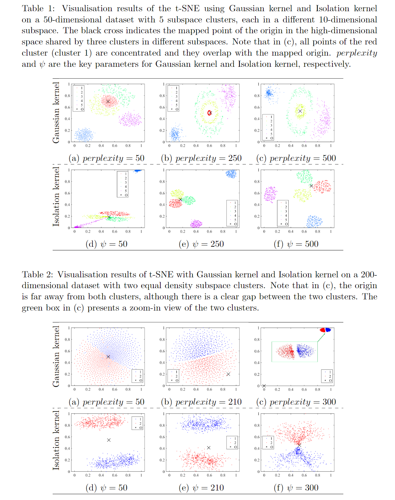

# IKt-sne

This Matlab code is used for demonstration of using t-SNE with Isolation kernel.

Written by Ye Zhu, Deakin University, July 2021, version 1.0.

This software is under GNU General Public License version 3.0 (GPLv3)

This code is a demo of method described by the following publication: Zhu, Y. and Ting, K.M., 2021, July. Improving the Effectiveness and Efficiency of Stochastic Neighbour Embedding with Isolation Kernel. Journal of Artificial Intelligence Research.

The published version can be obtained at: https://jair.org/index.php/jair/article/view/12904

## Visualization Examples

<em>Simply replacing Gaussian kernel with Isolation kernel in t-SNE significantly improves the quality of the final visualisation output (without creating misrepresented structures) and removes one key obstacle that prevents t-SNE from processing large datasets.<em>

